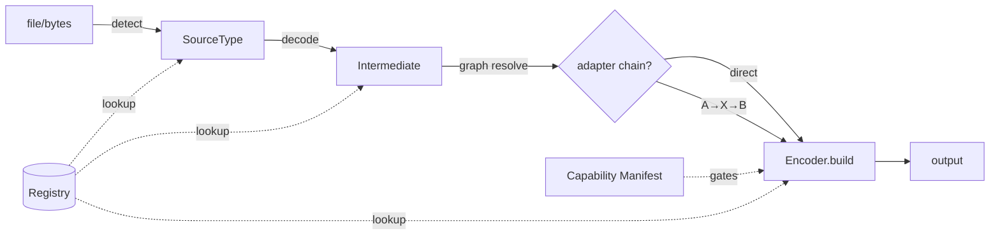

# Design: Plugin Core

## Current state (what we refactor)
- **Desktop** `converter.py::OptimizedMediaConverter`: hardcoded `valid_extensions`, manual
  extension branching in `find_comics`/`extract_and_prepare`, and per-format output methods
  (`to_cbz`, `to_zip`, `to_pdf`). Adding a format = editing these methods. This is the debt.
- **Mobile** already separates `ComicSource.loadPages()` (input) from `OutputFormat.build(pages)`
  (output) with an `id`/`extension`/`label` shape. We generalize this same split.

## Target model (both repos share these concepts)

```
            detect (PC-3)            decode                 build
file/bytes ───────────► SourceType ───────► Intermediate ───────► output bytes/file
                                              (PC-2)
                         registry lookup (PC-1) + graph resolve (PC-4)
                         gated by capability manifest (PC-5)
```

### Components

1. **Intermediate (PC-2)** — tagged payloads passed between stages:
   `ImageSet` (ordered pages + per-image meta), `Document` (paged, e.g. PDF), `Archive`
   (tree of entries), `TextData` (structured/text rows or markup), `ByteStream` (opaque passthrough).

2. **Decoder** — `decode(source) -> Intermediate`. Knows ONE input type. Replaces the
   `extract_and_prepare` branches. Carries the Zip-Slip-safe extraction, PDF→pixmap, loose-image
   handling as separate decoders.

3. **Encoder (output format)** — `build(intermediate, profile) -> output`. Replaces `to_cbz/to_zip/
   to_pdf`. Mobile's `OutputFormat` becomes this directly.

4. **Registry (PC-1)** — three tables:
   - `detectors`: signature → source_type
   - `decoders`: source_type → Decoder
   - `encoders`: format_id → Encoder (declares accepted Intermediate kind)
   Handlers register via decorator (Python) / static registration list (Dart).

5. **Graph resolver (PC-4)** — builds path from the source's Intermediate kind to the target
   encoder's accepted kind. Edges = registered cross-intermediate adapters (e.g. `Document→ImageSet`
   = PDF render; `ImageSet→Document` = images→PDF). BFS for shortest chain; no path → typed error.

6. **Capability manifest (PC-5)** — declarative table `{format_id: {read: bool, write: bool,
   platforms: {...}}}`. Resolved at startup against the running platform. Registry refuses to expose
   gated targets; UI reads the same manifest to grey them out.

7. **Module loader (PC-6)** — Python: `importlib.metadata` entry points group `comiconv.modules`
   (fallback: explicit import list in a `modules/` package). Dart: a compile-time list of module
   registrars, with heavy modules behind a build flag / separate package. Base build registers only
   light modules.

8. **Conversion profile (PC-7)** — `{target_format, quality, resize, flags{strip_exif, grayscale…}}`
   threaded into every `Encoder.build`. Source-type-agnostic.

## Key decisions
- **Generalize, don't rewrite** the mobile model — it already validates the decode/build split.
- **Desktop mirrors mobile concepts** but stays Pythonic (decorators + entry points).
- **Adapters are first-class registry citizens**, so PDF↔image conversions are just edges — this is
  what makes Split-PDF and image→PDF fall out of the graph for free.
- **Manifest is data, not code** — one source of truth shared by registry and UI.

## Risks / mitigations
- *Over-engineering for a small app* → keep the registry ~100–150 LOC; no DI framework, plain dicts.
- *Regression during refactor* → PC-8 golden tests: capture current outputs first, assert parity.
- *Dart/Python drift* → keep the concept names identical across repos; document the mapping here.

## Mermaid (recommend installing `mermaid-studio` for rendered diagrams)

</content>
